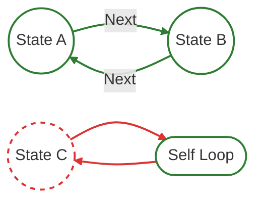

# Validation Comparison: Typestate vs. tokio-fsm

This example highlights the distinction between type-level correctness and graph-level validation.

## Theoretical Foundation

tokio-fsm models a Finite State Machine as the 5-tuple $(Q, \Sigma, \delta, q_0, F)$.

The Rust compiler is highly effective at enforcing type correctness. However, typical typestate patterns do not encode sufficient information to verify global graph properties like reachability or connectivity.

### Comparison

| Feature | Typestate Pattern | tokio-fsm |
|---------|-------------------|-----------|
| Scope | Local (transition-level) | Global (graph-level) |
| Verification | "Is this transition type-valid?" | "Is this state reachable from $q_0$?" |
| Structure | Emerges across multiple blocks | Declared as a single validated graph |
| Concurrency | Challenging with shared state | Native (actor-model design) |

Typestate ensures invalid transitions are unrepresentable, but it cannot guarantee the overall graph is complete or connected.

---

## The Reachability Problem

In automata theory, a state $q$ is reachable if there exists a sequence of events $q_0 \xrightarrow{\sigma_1} \dots \xrightarrow{\sigma_n} q$.

1. Typestate (`bin/typestate_logic.rs`): Verifies that types and transitions are valid in isolation, but cannot detect orphaned states disconnected from $q_0$ because reachability is a global property.
2. tokio-fsm (`bin/fsm_logic.rs`): Performs reachability analysis (DFS) on the full transition graph $(Q, \delta)$. If a state has no path from $q_0$, compilation fails.



---

## Running the Comparison

```bash
just compare-validation
```

This command runs `cargo check` on both:
*   Typestate: Succeeds despite the orphaned logic.
*   tokio-fsm: Fails with a reachability validation error.

---

## Why Unreachable States Occur

Orphaned states are often a natural byproduct of a project's evolution:
1. Protocol Evolution: Prototyping a new path (like a "Refund" flow) that isn't yet integrated.
2. Refactoring: Legacy states remaining after a transition restructure.
3. Conditional Logic: Transitions hidden behind feature flags.

tokio-fsm ensures your implementation stays in sync with your intended protocol. It provides immediate feedback so you can decide whether to connect or clean it up.

---

## Scope & UX

tokio-fsm does not claim unreachable code is a "problem" in general Rust. Rather, it delivers a specialized UX (via macros) for a specific goal: mathematically well-defined FSMs.

In many practical systems, we operate on the accessible subgraph ($q_{\text{reachable}}$). tokio-fsm adopts this stricter interpretation, requiring a fully reachable state space to ensure your implementation corresponds 1:1 with your formal model.
